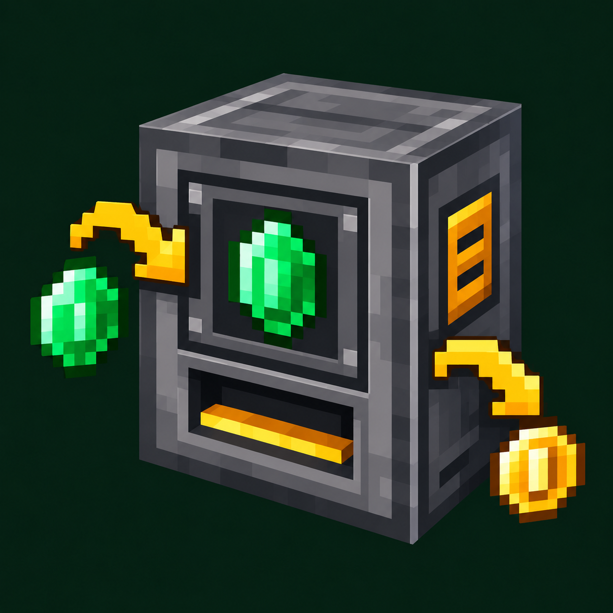

# Tom's Trading Network — Unofficial 1.12.2 Port

An **unofficial native Minecraft 1.12.2 / Forge port** of
[Tom's Trading Network by tom5454](https://github.com/tom5454/Toms-Trading-Network).
This repository is independent of the original project's releases and support.

Maintained by [RPM147](https://github.com/RPM147). Canonical source:
[toms-trading-network-1.12.2-port](https://github.com/RPM147/toms-trading-network-1.12.2-port).

## Status

Current package version: **0.3.4-port.13 (Beta)**, based on port.12 gameplay.
Download the JAR from [GitHub Releases](https://github.com/RPM147/toms-trading-network-1.12.2-port/releases/tag/v0.3.4-port.13),
not the source ZIP. This is not a CurseForge or Modrinth approval. The maintainer
reports 5–6 hours of multiplayer use with friends of the pre-port.13 build. This is
user-reported experience, not a runtime test of the new package. Automated and
manual verification have different scopes; see [validation](docs/VALIDATION.md).

## Features

- Owner-managed vending machines with item-for-item offers, separate stock and earnings.
- Integer offer quantities and trade batches up to 1024, subject to item/capacity limits.
- Sided automation, Ore Dictionary payment filters and optional JEI / The One Probe integration.
- Rebindable **G** key opens a server-wide directory of known machines and owners.
- Product/payment previews and search by recorded item, machine or owner name.
- Remote trade-only access with bounded temporary chunk loading and live target checks.
- Optional public chat receipts for successful trades.
- A server-managed **Currency & Tax** tab for selected machine UUIDs.
- Search/tab/page/scroll restoration after returning from a trade, keyboard navigation
  and full error/help details with **F1**.

The Currency & Tax tab is a shared category, **not automatic tax collection** or
a new currency/account system. Cached offers are not stock or permission guarantees.
Browsing does not load chunks. Old machines may need discovery before appearing.

## Screenshots

Actual gameplay screenshots supplied by the maintainer. Some player names have
been redacted for privacy. Modpack-specific items, including the pictured coins,
come from other mods; this port does not add a currency item system.
The AI-generated project icon above is branding artwork, not an in-game render.

### Vending machines in the world

### Machine directory and offer previews

Browse recorded offers with product/payment previews and search by item, machine
or owner. Opening a listing performs fresh access and offer checks.

### Shared Currency & Tax tab

Administrators choose which machines appear in this shared category. These are
server-configured trades, not automatic tax collection.

### Remote trading

Review the payment and received items, choose the number of trades, then confirm.
This trade-only screen does not expose a machine's private inventory.

### Owner management

The owner's management screen exposes offer configuration, sale stock and earnings.
These private inventory slots are not available to ordinary customers.

## Requirements and installation

- Minecraft **1.12.2**, target Forge **14.23.5.2859**, Java **8**.
- Install the same exact port version on the server/host **and every client**.
- Use one TTN JAR only; do not co-install another release with the same mod ID.
- Back up the entire stopped world before installing or upgrading. First try a copy.
- Copy the normal release JAR into `mods`; do not use source/development JARs.

The persistent mod ID remains `toms_trading_network` for world compatibility.
Directory format 2 reads format 1; tile format remains 3 and preview format 1.
Older ports may preserve but cannot read newer data. A JAR-only downgrade is not
a safe rollback: restore a consistent whole-world backup instead.

Optional integrations are not required runtime dependencies. Protection adapters
were implemented against MineColonies **1.12.2-0.11.841-ALPHA** (distributed in a
BETA-named JAR) and Electroblob's Wizardry **4.3.19**. Unsupported or unverifiable
protection cannot silently authorize remote access. Other versions and arbitrary
claim mods are not universally certified. See [architecture](docs/ARCHITECTURE.md).

## Documentation

- [Player and administrator guide](docs/USAGE.md)
- [Building from source](docs/BUILDING.md)
- [Offline discovery of existing machines](docs/BACKFILL.md)
- [Architecture and safety boundaries](docs/ARCHITECTURE.md)
- [Changelog](CHANGELOG.md) / [validation scope](docs/VALIDATION.md)

## Attribution, license and development disclosure

Original project and upstream code/assets: **tom5454**. The original MIT copyright
notice is preserved in [LICENSE](LICENSE) and included in the packaged mod.
See [CREDITS](CREDITS.md) for source baselines and the clean-snapshot history policy.

This port and its extensions were developed with substantial generative-AI
assistance, including implementation, tests, translations and documentation,
under human direction and gameplay testing. This statement concerns the port;
it makes no claim that the upstream project used AI. The mod does not depend on
an AI service at runtime.

For port-specific bugs, use this repository's Issues when enabled. Include the
exact Minecraft/Forge/mod versions and reproduction steps. Redact private paths,
tokens, IP addresses and player information from logs before posting. Please do
not send port-specific bug reports to the upstream author.
